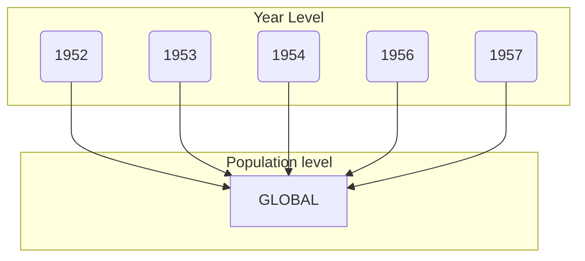

# Babine
Analysis of Babine fish fence data
Expansion of coho counts past the end date of operations

```mermaid
graph TB
A(1952)-->B[GLOBAL]
C(1953)-->B[GLOBAL] 
D(1954)-->B[GLOBAL]
E(1956)-->B[GLOBAL]
F(1957)-->B[GLOBAL]

subgraph Year Level
A & C & D & E & F
end

subgraph Population level
B
end


```
